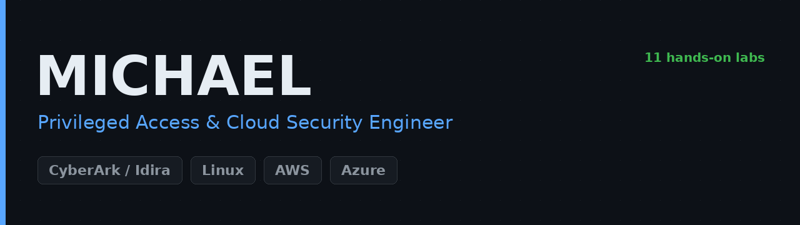

<!--
  Michael's GitHub profile README.
  Lives in a repo named exactly after your username (github.com/ChromeData/ChromeData).
  Edit the CONFIRM spots with your real details.
-->

  

### Hi, I'm Michael 👋

[][linkedin]
[][labs]
[][blog]

I'm a **privileged access and cloud security engineer** working where PAM meets cloud infrastructure. The accounts, secrets, and escalation paths that most tooling treats as two separate problems, I treat as one.

I learn by building the thing and writing down where it broke. Everything below is a real lab: a real environment stood up, real tooling run against it, and honest notes on what failed. **Right now I'm building secrets management patterns that put a CyberArk/Idira lens on cloud native tooling. That is my main focus.**

## 🔧 What I'm building

- **[PAM x Cloud Labs][labs]:** 11 hands on labs across CyberArk/Idira, Linux, AWS, and Azure. Each documents what I built, what broke, and what I would do differently.
- **[Conjur to Terraform secrets injection][lab01]:** provisioning AWS with **zero credentials in Terraform state**, proven by an automated check.
- **[Shadow admin audit][lab02]:** scoring CyberArk's SkyArk against known escalation paths in **AWS and Azure**.
- **[Secrets Manager as a PAM control plane][lab05]:** a CyberArk engineer's honest evaluation of the cloud native alternative to a vault.
- _Full index in the [labs repo][labs]: Kubernetes RBAC, RHEL 9 hardening, Sentinel detections, IAM least privilege, and more._

## 🛡️ Focus areas

`Privileged Access Management` · `Secrets Management` · `IAM least privilege` · `Policy as code` · `Cloud security posture` · `Infrastructure as code`

## 📜 Certifications

**Privileged Access, CyberArk/Idira**

**Linux, Red Hat**

**Identity and Security**

**Education**

<!-- Add any remaining WGU/CompTIA certs you hold here in the same format, e.g.:

No AWS certification listed. Add one here only if you actually hold it. -->

## 🧰 Tech I work with

### Connect

[][linkedin]
[][gh]
[][blog]

 

<!-- LINKS: confirm the blog before sharing. -->
[labs]: https://github.com/ChromeData/PAM-Cloud-Labs
[lab01]: https://github.com/ChromeData/Conjur-Terraform-AWS
[lab02]: https://github.com/ChromeData/SkyArk-Shadow-Admin-Audit
[lab05]: https://github.com/ChromeData/Secrets-Manager-PAM
[gh]: https://github.com/ChromeData
[linkedin]: https://linkedin.com/in/michael-williams-21938325a
[blog]: https://CONFIRM-your-blog
